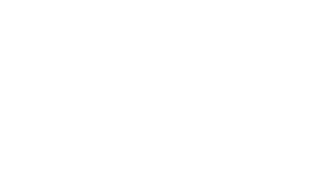
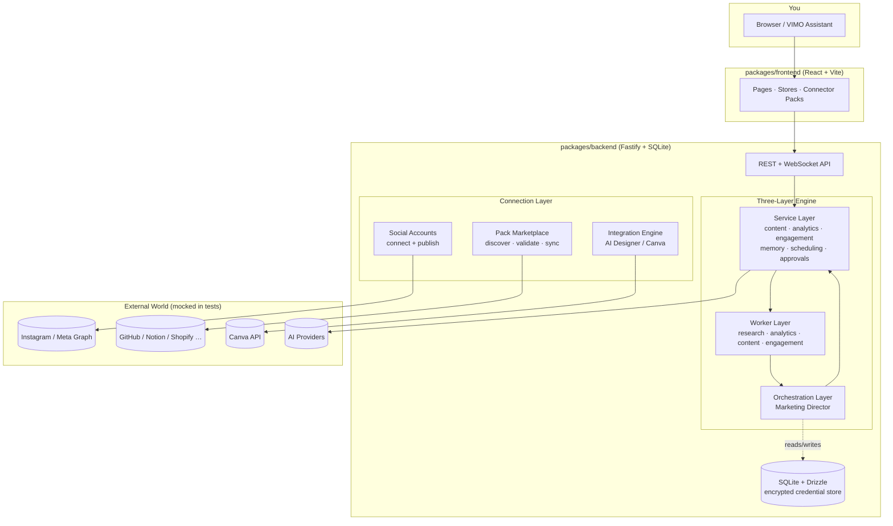

<p align="center">
  
</p>

# VIMO — Vibe Marketing Operations

**The open-source autonomous marketing OS for people who have a brand to grow, not a DevOps team to manage.**

You describe what you want. VIMO researches trends, writes the content, posts it, replies to
comments, learns from every result, and tells you _why_ — in plain English. No agency. No
$4,000/month SaaS stack. No copy-pasting API keys into developer portals.

> Type one sentence. VIMO handles the rest.

## 📚 Resources

- **[Get Started — Zero Keys Needed](GET_STARTED.md)** — the non-technical, plain-language quick start (try the Demo, connect with one click).
- **[Extending VIMO](docs/EXTENDING_VIMO.md)** — write your own connector or Pack in ~50 lines.
- **[Contributing](CONTRIBUTING.md)** · **[Security](SECURITY.md)** · **[Roadmap](ROADMAP.md)** · **[Code of Conduct](CODE_OF_CONDUCT.md)**
- **[GitHub Discussions](https://github.com/yourusername/vimo/discussions)** — questions, ideas, and roadmap input.
- **[Releases](https://github.com/yourusername/vimo/releases)** — automated versioning & changelog via Changesets.

> Tip: pin these to the repo's GitHub **About** section so newcomers find them instantly.

---

## Why VIMO exists (for the non-technical creator)

Most "AI marketing" tools were built for people who already speak fluent API. You're asked to
create a developer app, generate a client secret, paste an access token, configure a webhook, and
pray the rate limits don't kill your launch.

VIMO is built for the other 95%:

- **You don't need to be technical.** GitHub, Notion, Canva, LinkedIn, and X connect with a single click — VIMO
  runs the OAuth handshake for you. Everything else connects with a key you can copy in two clicks
  from the platform's own settings (and VIMO tells you exactly where to find it).
- **You stay in control.** Nothing goes live without your say-so unless you choose Autonomous Mode.
  Every action waits in an approval queue you can skim in seconds.
- **It explains itself.** Every recommendation comes with the data points that justify it and a
  confidence score. No black boxes.
- **It learns your brand.** Not generic AI slop — VIMO builds a "Content DNA" from what actually
  works for _your_ audience, and gets smarter with every post.

If you can write a tweet, you can run a complete autonomous marketing operation.

---

## ✨ Features

- **The Marketing Director** — a 24/7 CMO that orchestrates four specialized workers
  (Research, Analytics, Content, Engagement) into a daily morning briefing with prioritized,
  explained actions.
- **Approval Queue** — human-in-the-loop control. Approve, reject, or batch-approve by type.
- **Brand Brain & Content DNA** — permanent memory of every post, campaign, lesson, and audience
  insight. VIMO evolves its voice automatically.
- **VIMO Assistant** — a conversational system controller (`Cmd/Ctrl + K`). "Grow my Instagram,"
  "Why did engagement drop last month?" — and it operates the whole platform for you.
- **Brand Roast** — a brutally honest 0–100 score with specific fixes. Designed to be shared.
- **Marketing Time Machine** — root-cause analysis over 12 weeks of your own data.
- **Content Intelligence** — Reels scripts, three-tier hashtag rotation, growth-optimized posting
  times, content variety system.
- **Growth Loops** — detect a winner, then auto-generate follow-ups, repurposed cross-posts, and
  A/B tests.
- **Explainability** — every suggestion shows the _why_, _data points_, _confidence_, and _method_.
- **Model Router & Cost Transparency** — route tasks to the right model, see real token/cost
  dashboards. ~$5–15/month for a moderately active account.
- **Native Connectors + Pack Marketplace** — a growing catalog of connectors across social,
  intelligence, design, commerce, and analytics. Every connector ships with an honest
  **readiness badge** (`Ready` · `Connect only` · `Coming soon`) so you always know what works
  today vs. what's still being wired (see [Coverage & honest status](#coverage--honest-status)).

---

## 🚀 2-Minute Quickstart

You don't need a single API key to see VIMO work.

### Option A — Try the Demo (zero setup)

1. Launch VIMO (see **Run it** below).
2. On the login screen, choose **"Try the Demo."** You land in a fully-working, clearly-badged
   **Demo** brand — sample posts, analytics, and a content plan. Nothing here is ever mistaken for
   a real account.

### Option B — Connect and go live

1. **Launch VIMO** (see **Run it** below). Your browser opens to
   `http://localhost:5173` and the system check runs automatically.
2. **Set a 4–8 digit PIN** to log in (it's a local, single-user app).
3. **Connect one AI provider** (OpenAI, Anthropic, or any OpenAI-compatible endpoint like Groq or
   Ollama). This is the _only_ key required to generate content.
4. **Connect a social account** — click **Connect** on Instagram, LinkedIn, X, etc. One-click
   providers (GitHub, Notion, Canva) need zero keys.
5. **Run the Marketing Director.** You get a morning briefing with a top recommendation. Click
   **Approve**, and VIMO publishes, schedules, and learns.

That's it. One key and you're running a complete autonomous marketing operation.

### Run it

```bash
# 1. Clone
git clone https://github.com/yourusername/vimo.git
cd vimo

# 2. Install (monorepo: backend + frontend + shared)
npm install

# 3. Configure — copy the template and fill in ONLY what you want to use
cp .env.example .env
#   (an ENCRYPTION_KEY is generated for you on first run if absent)

# 4. Start backend + frontend together
npm run dev
```

Then open **http://localhost:5173**. Prefer one-click launchers? Use `Start VIMO.bat`
(Windows), `Start VIMO.command` (macOS), or `start-vimo.sh` / `docker-compose.yml` (Linux).
No Docker required — everything runs natively with SQLite.

---

## 🏗️ Architecture

VIMO is a typed monorepo with three layers. The key idea: **you don't build agents — you build
workers and connectors, and the Director orchestrates them.**



| Layer                   | Responsibility                       | Examples                                                                 |
| ----------------------- | ------------------------------------ | ------------------------------------------------------------------------ |
| **Service Layer**       | Reusable business logic              | content generation, analytics, engagement, memory, scheduling, approvals |
| **Worker Layer**        | Focused functions the Director calls | research, analytics, content, engagement                                 |
| **Orchestration Layer** | Coordinates workers into a briefing  | the Marketing Director                                                   |

---

## 🔌 How Connections Work

This is the part contributors care about most, so we'll be precise. Every external integration
flows through VIMO's **Connection Layer**, and every secret is **encrypted at rest** (AES-256-GCM)
before it touches the database.

### 1. Social Accounts — connect

- **One-click managed providers** (GitHub, Notion, Canva, **LinkedIn**, **X**): VIMO opens the
  provider's OAuth popup, the user approves, and VIMO receives the access + refresh tokens. They are
  encrypted immediately via `credentialStore` and stored in `app_settings` keyed by
  `cred:<connectorId>:<key>`. LinkedIn and X are the platforms people try first, so they're managed
  (zero keys) out of the box when their app credentials are configured.
- **Other platforms**: you paste the key the platform already shows you (VIMO points you to the
  exact settings page). On save, VIMO can run a **live connectivity test** before marking the
  connector active.
- The connector row lives in the `connectors` table; the secret never does.

### 2. Social Accounts — publish

```
VIMO Assistant / Scheduler
   → Publish Service (provider-agnostic router)
      → Native Platform Handler (e.g. instagramHandler)
         → Platform API (e.g. Meta Graph API)
```

The handler does the real work VIMO is responsible for — verifying the account type, creating a
media container, polling until it's ready, publishing, and mapping any API error (expired token,
rate limit, personal account) into a friendly, token-free message. **VIMO's own logic is what we
test** (see `packages/backend/src/tests/connectionSocialAccounts.test.ts`); only the platform API
is mocked.

### 3. Pack Marketplace — discover & validate

A "Pack" turns an external tool (Shopify, GitHub, Stripe, SEO, …) into live context for VIMO.

- **Discover** — `discoverPack(provider, credentials)` makes a _real, minimal_ read-only call to
  the provider (list repos, count products, read balance) and returns honest discovery items. If
  the call fails, it returns `success: false` with the real error — **VIMO never fabricates
  metrics.**
- **Validate** — before a credential-based pack is marked "Connected," VIMO re-runs that same live
  call. A pack is only "Connected" when access genuinely works.
- **Sync** — installed packs run through a **`PackAdapter`** that pulls live data, records the sync
  outcome on the connector, and reports connection health.

### 4. AI Designer (Integration Engine)

The AI Designer connects to Canva through the Integration Engine, which wraps the real Canva REST
API using the access token of the Canva connector you already connected. Designs are created in
_your_ Canva account.

> 🔒 **Leakage guarantee:** errors are sanitized before they reach the UI (no tokens, no OAuth
> details), the session token is only ever returned to the verified client, and external API
> boundaries are the _only_ thing our connection-layer tests mock. See [SECURITY.md](SECURITY.md).

---

## 📊 Coverage & honest status

We'd rather under-promise than lose your trust after a star. VIMO ships a large _catalog_ of
connectors, but not every one can publish end-to-end yet. Each connector carries a readiness badge
you can see in the Connector Hub:

| Badge            | Meaning                                                                                                                        |
| ---------------- | ------------------------------------------------------------------------------------------------------------------------------ |
| **Ready**        | You can connect **and** act end-to-end today — publishing, generation, or querying actually works and is covered by our tests. |
| **Connect only** | You can connect and pull context/analytics, but automated publishing for that platform isn't wired up yet. We say so plainly.  |
| **Coming soon**  | Advertised in the catalog, but the connector/adapter hasn't been built.                                                        |

Current reality (no embellishment):

- **Ready** — Instagram, Facebook, LinkedIn, X, Threads, Reddit, Medium, Bluesky (real, tested
  publish paths); all LLM providers; Canva AI Designer; Higgsfield video generation.
- **Connect only** — YouTube, TikTok, Pinterest (publish needs media upload we don't do yet);
  WordPress, Shopify, Mailchimp, Google/Meta Ads, HubSpot, Google Analytics, Notion, Slack; and
  the MCP intelligence sources (GitHub, Notion, Slack, Drive, Linear, Figma, Trello, Asana,
  Dropbox) which feed VIMO context but don't publish on your behalf.

If you want a platform moved from _Connect only_ → _Ready_, the publish handler is the place to
contribute — see `packages/backend/src/services/vimoSocialPublishService.ts`.

---

## 🔒 Security & Secrets

- **Credentials are encrypted at rest** (AES-256-GCM) with a key from your `.env`
  (`ENCRYPTION_KEY`). Decrypted only in memory, only when used.
- **Local-first.** Single-user, runs on `localhost`. The session token is a random 256-bit value;
  see [SECURITY.md → What we store and why](SECURITY.md) for the full, honest inventory.
- **No telemetry.** VIMO does not phone home.
- **Prompt sanitization** defends against prompt injection from scraped content.
- **Reproducible test boundaries.** Our tests mock the _external API_, never VIMO's logic — so a
  green suite means the real code paths work.

---

## 🧩 Extensibility — write your own connector in ~50 lines

VIMO is designed to be extended by _you_. The `PackAdapter` pattern is intentionally tiny:

- Add a **preset** in `packages/backend/src/connectors/presets/index.ts`.
- Implement a **handler** (for social publishing) or a **PackAdapter** (for the marketplace).
- Register it and open a PR.

A complete, copy-paste walkthrough is in **[docs/EXTENDING_VIMO.md](docs/EXTENDING_VIMO.md)** —
including a 50-line example connector and the discover/validate contract.

---

## 🛠️ Tech Stack

| Layer              | Technology                     |
| ------------------ | ------------------------------ |
| Frontend           | React 18 + TypeScript + Vite   |
| Backend            | Fastify + Node.js + TypeScript |
| Database           | SQLite + Drizzle ORM           |
| Agents             | LangGraph.js + LangChain.js    |
| Real-Time          | Socket.io                      |
| Local Vector Store | LanceDB                        |
| Styling / State    | Tailwind CSS · Zustand         |

**Zero Docker required.** SQLite, an in-memory job-queue fallback, and optional local AI via
Ollama mean VIMO can run entirely offline.

---

## 🤝 Contributing

We want this to be _the_ place indie hackers and agencies extend. Start with
**[CONTRIBUTING.md](CONTRIBUTING.md)** — it covers the dev setup, the testing expectations (every
connection change ships with an integration test), and how to add a connector, a Pack, or a worker.
Versions and the changelog are automated via **[Changesets](.changeset/README.md)** — open a PR with
a changeset, never bump a version by hand.

Good first contributions (see the [`good first issue`](https://github.com/yourusername/vimo/labels/good%20first%20issue) label and the [label legend](CONTRIBUTING.md#label-legend-one-liners)):

- Add a connector preset.
- Add a `PackAdapter` for a new intelligence source.
- Improve error messages (no silent catches).
- **Add tests** for a connection path — confidence is how this project earns its stars.

---

## 📄 License

VIMO is released under the [MIT License](LICENSE). Built for creators, by creators.

---

<p align="center">
  <b>No agencies. No $4,000 SaaS bills. Just type your goal, click GO, and watch it happen.</b>
</p>
