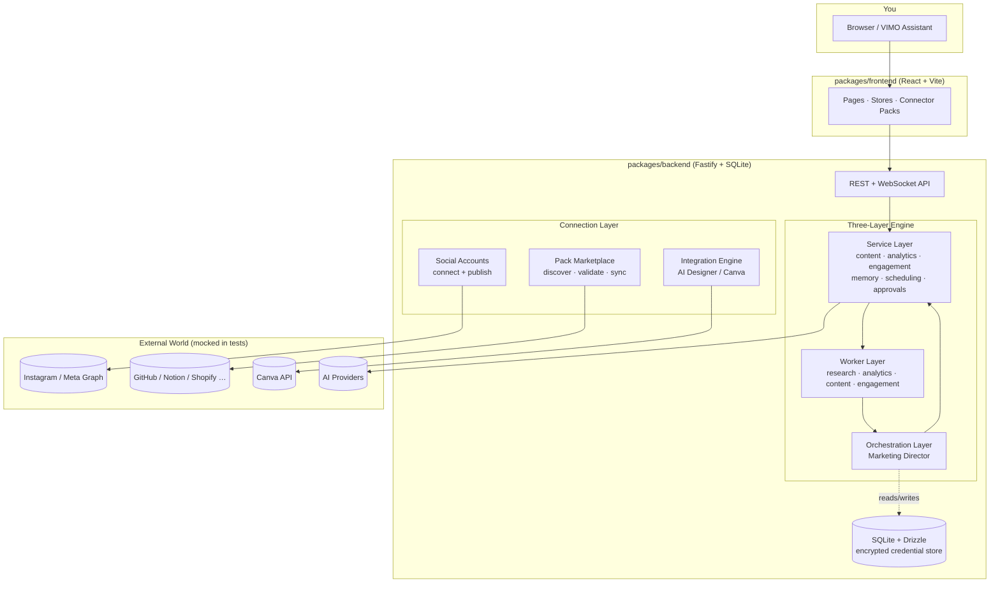

<p align="center">
  
</p>

# VIMO — Vibe Marketing Operations

[](https://github.com/Krish-1507/VIMO_OSS/actions/workflows/ci.yml)
[](https://github.com/Krish-1507/VIMO_OSS/actions/workflows/nightly.yml)

**The open-source autonomous marketing OS for people who have a brand to grow, not a DevOps team to manage.**

You describe what you want. VIMO researches trends, writes the content, posts it, replies to
comments, learns from every result, and tells you _why_ — in plain English. No agency. No
$4,000/month SaaS stack. No copy-pasting API keys into developer portals.

> Type one sentence. VIMO handles the rest.

## 📚 Resources

- **[Get Started — Zero Keys Needed](GET_STARTED.md)** — the non-technical, plain-language quick start (try the Demo, connect with one click).
- **[Connector & Marketplace Verification](docs/CONNECTORS_VERIFICATION.md)** — manual smoke-tests + automated suite that prove install/uninstall/connect/disconnect are bulletproof.
- **[Extending VIMO](docs/EXTENDING_VIMO.md)** — write your own connector or Pack in ~50 lines.
- **[Contributing](CONTRIBUTING.md)** · **[Security](SECURITY.md)** · **[Roadmap](ROADMAP.md)** · **[Code of Conduct](CODE_OF_CONDUCT.md)**
- **[GitHub Discussions](https://github.com/Krish-1507/VIMO_OSS/discussions)** — questions, ideas, and roadmap input.
- **[Releases](https://github.com/Krish-1507/VIMO_OSS/releases)** — automated versioning & changelog via Changesets.

> Tip: pin these to the repo's GitHub **About** section so newcomers find them instantly.

---

## Why VIMO exists (for the non-technical creator)

Most "AI marketing" tools were built for people who already speak fluent API. You're asked to
create a developer app, generate a client secret, paste an access token, configure a webhook, and
pray the rate limits don't kill your launch.

VIMO is built for the other 95%:

- **You don't need to be technical.** GitHub, Notion, Canva, LinkedIn, and X connect with a single click — VIMO
  runs the OAuth handshake for you. Everything else connects with a key you can copy in two clicks
  from the platform's own settings (and VIMO tells you exactly where to find it).
- **You stay in control.** Nothing goes live without your say-so unless you choose Autonomous Mode.
  Every action waits in an approval queue you can skim in seconds.
- **It explains itself.** Every recommendation comes with the data points that justify it and a
  confidence score. No black boxes.
- **It learns your brand.** Not generic AI slop — VIMO builds a "Content DNA" from what actually
  works for _your_ audience, and gets smarter with every post.

If you can write a tweet, you can run a complete autonomous marketing operation.

---

## 🛡️ Hardened for production — what this release guarantees

This release explicitly bulletproofs the two surfaces that get touched the most: **Pack
Marketplace** (install / uninstall) and **Social Accounts** (OAuth, app passwords,
disconnect). If you only have two minutes, here is what changed and what is now enforced
by an automated test:

- **Pack install is idempotent.** Re-installing the same pack no longer creates a
  duplicate row — it returns `200` with `alreadyInstalled: true`.
- **Pack uninstall is atomic.** Uninstalling a pack always tears down its underlying
  connectors (credentials + MCP server sockets) too, so we never leak orphaned rows.
- **Bad payloads are rejected with honest 400s** — non-object `config`, non-array
  `discoveryItems`, missing `packId` — instead of corrupting the database.
- **Disconnecting a non-existent social account returns `404`**, not `200`-and-lie.
  Disconnecting a platform with zero connections returns `200` with `disconnected: 0`,
  not `500`.
- **OAuth popups no longer leak timers.** The `openOAuthPopup` flow uses a single
  `finalize` channel so every interval is cleared exactly once, no matter which path
  (poll success, popup-closed, grace-timeout) wins the race.
- **Bluesky (app-password) validates inputs up front** — a short app password or
  missing handle is a clean `400`, not a half-written connector.
- **Abandoned OAuth handshakes are reaped** after 15 minutes so the Connector Hub
  doesn't accumulate "inactive" rows from users who closed the popup.
- **OAuth tokens land on the real connector.** Pack flows handshake under a synthetic
  id; the callback now adopts those credentials onto the created row (and enriches
  it) instead of leaving a "connected" row with no tokens behind.
- **Connections self-heal and reconnect in one click.** Hourly health checks refresh
  expiring OAuth tokens, warn before guided-provider tokens lapse, and route every
  alert to the right fix screen (Social Accounts vs. Connector Hub).
- **Director runs are observable.** Every run persists a `running` row up front and
  ends in `completed`/`failed` — no more polling a void, and keyless environments
  skip the dead free tier straight to instant fallbacks instead of hanging.
- **CSRF + session enforcement is covered by tests** on every state-changing route
  (`x-session-token` + double-submit `x-csrf-token`).

All of the above is covered by `packages/backend/src/tests/connectorsMarketplaceRoutes.test.ts`
(26 tests, real Fastify app, real DB, mocked HTTP only) plus `oauthCallbackAdoption`,
`assistantBrandResolution`, and `marketingDirector` lifecycle tests. Full breakdown +
copy-paste manual smoke tests live in **[docs/CONNECTORS_VERIFICATION.md](docs/CONNECTORS_VERIFICATION.md)**.

---

## ✨ Features

- **The Marketing Director** — a 24/7 CMO that orchestrates four specialized workers
  (Research, Analytics, Content, Engagement) into a daily morning briefing with prioritized,
  explained actions.
- **Approval Queue** — human-in-the-loop control. Approve, reject, or **batch-approve an entire
  campaign in one click**; pending posts group by campaign in the Approvals UI.
- **Webhooks** — event delivery (post published/failed, test fires) with **HMAC-signed payloads**,
  delivery history, and a **retry queue with exponential backoff**.
- **Brand Brain & Content DNA** — permanent memory of every post, campaign, lesson, and audience
  insight. VIMO evolves its voice automatically.
- **VIMO Assistant** — a conversational system controller and the app's front door
  (dashboard hero, sidebar entry, `Cmd/Ctrl + K`, auto-opens after onboarding). "Grow my
  Instagram," "Why did engagement drop last month?" — and it operates the whole platform
  for you, always on your active brand.
- **Brand Roast** — a brutally honest 0–100 score with specific fixes. Designed to be shared.
- **Marketing Time Machine** — root-cause analysis over 12 weeks of your own data.
- **Content Intelligence** — Reels scripts, three-tier hashtag rotation, growth-optimized posting
  times, content variety system.
- **Growth Loops** — detect a winner, then auto-generate follow-ups, repurposed cross-posts, and
  A/B tests.
- **Explainability** — every suggestion shows the _why_, _data points_, _confidence_, and _method_.
- **Model Router & Cost Transparency** — route tasks to the right model, see real token/cost
  dashboards. ~$5–15/month for a moderately active account.
- **Native Connectors + Pack Marketplace** — a growing catalog of connectors across social,
  intelligence, design, commerce, and analytics. Every connector ships with an honest
  **readiness badge** (`Ready` · `Connect only` · `Coming soon`) so you always know what works
  today vs. what's still being wired (see [Coverage & honest status](#coverage--honest-status)).
- **Real publishing for YouTube, TikTok & Pinterest** — resumable YouTube uploads, TikTok
  Content Posting API, and Pinterest v5 pins, alongside Instagram/Facebook/LinkedIn/X/Threads/
  Reddit/Medium/Bluesky.
- **Multi-account per platform** — connect several Instagram/LinkedIn/X accounts and pick the
  publishing account per post ("Publish as" in the Scheduler).
- **Autopilot guardrails** — daily post cap + daily AI spend cap, enforced in content generation
  and scheduling, plus "Run next week now."
- **Analytics CSV export** — download post performance for any date range and brand.
- **Email notifications** — dependency-free SMTP client (plain/STARTTLS/implicit TLS) with a
  settings UI and test send.

- **Plugin API** — register third-party connectors with actions and install them as real
  connectors.

---

## 🚀 2-Minute Quickstart

You don't need a single API key to see VIMO work.

### Easiest: one command

```bash
npm i -g vimo-oss
vimo
```

That's it — no git, no Docker, no API keys. The launcher downloads VIMO,
installs it, builds it, starts it on a free port, and opens your browser.
On Windows you can type `VIMO` or `vimo` in cmd or PowerShell; on macOS and
Linux both spellings work after install. Onboarding auto-detects a local
Ollama install and offers **"Use free local AI"** with one click — no account,
no key, nothing leaves your machine. Press `Ctrl+C` to stop. First run takes a
few minutes (it's building the app for you); later starts are fast.

Useful launcher commands: `vimo doctor` (check your machine is ready),
`vimo --update` (updates the launcher itself, then the app — keeps your data),
`vimo --reset` (reinstall from scratch). Stuck on an old version?
`npm i -g vimo-oss@latest`, then `vimo --update`. Confirm what you're running
in Settings → About (app) and `vimo --version` (launcher).

### Option A — Try the Demo (zero setup)

1. Launch VIMO (see **Run it** below).
2. On the login screen, choose **"Try the Demo."** You land in a fully-working, clearly-badged
   **Demo** brand — sample posts, analytics, and a content plan. Nothing here is ever mistaken for
   a real account.

### Option B — Connect and go live

1. **Launch VIMO** (see **Run it** below). Your browser opens to
   `http://localhost:5173` and the system check runs automatically.
2. **Set a 4–8 digit PIN** to log in (it's a local, single-user app).
3. **Connect one AI provider** (OpenAI, Anthropic, or any OpenAI-compatible endpoint like Groq or
   Ollama). This is the _only_ key required to generate content.
4. **Connect a social account** — click **Connect** on Instagram, LinkedIn, X, etc. One-click
   providers (GitHub, Notion, Canva) need zero keys.
5. **Run the Marketing Director.** You get a morning briefing with a top recommendation. Click
   **Approve**, and VIMO publishes, schedules, and learns.

That's it. One key and you're running a complete autonomous marketing operation.

### Run it

```bash
# 1. Clone
git clone https://github.com/Krish-1507/VIMO_OSS.git
cd vimo

# 2. Install (monorepo: backend + frontend + shared)
npm install

# 3. Configure — copy the template and fill in ONLY what you want to use
cp .env.example .env
#   (an ENCRYPTION_KEY is generated for you on first run if absent)

# 4. Start backend + frontend together
npm run dev
```

Then open **http://localhost:5173**. Prefer one-click launchers? Use `Start VIMO.bat`
(Windows), `Start VIMO.command` (macOS), or `start-vimo.sh` / `docker-compose.yml` (Linux).
No Docker required — everything runs natively with SQLite.

#### Production mode (what the `vimo` command runs)

The launcher never uses dev servers. It builds once and serves everything from a
single port:

```bash
npm run build:app     # build frontend + backend
npm run start:app     # serve app + API on one port (default 3000)
```

The backend serves the built frontend itself (same origin — no CORS, no proxy)
and binds to `127.0.0.1` unless you set `HOST`.

---

## 🏗️ Architecture

VIMO is a typed monorepo with three layers. The key idea: **you don't build agents — you build
workers and connectors, and the Director orchestrates them.**


```mermaid
flowchart TB
  subgraph User["You"]
    U[Browser / VIMO Assistant]
  end

  subgraph Frontend["packages/frontend (React + Vite)"]
    FE[Pages · Stores · Connector Packs]
  end

  subgraph Backend["packages/backend (Fastify + SQLite)"]
    direction TB
    API[REST + WebSocket API]
    subgraph Layers["Three-Layer Engine"]
      SVC[Service Layer<br/>content · analytics · engagement<br/>memory · scheduling · approvals]
      WRK[Worker Layer<br/>research · analytics · content · engagement]
      ORCH[Orchestration Layer<br/>Marketing Director]
    end
    subgraph Conn["Connection Layer"]
      SA[Social Accounts<br/>connect + publish]
      PM[Pack Marketplace<br/>discover · validate · sync]
      INT[Integration Engine<br/>AI Designer / Canva]
    end
    MEM[(SQLite + Drizzle<br/>encrypted credential store)]
  end

  subgraph Ext["External World (mocked in tests)"]
    IG[(Instagram / Meta Graph)]
    GH[(GitHub / Notion / Shopify …)]
    CANVA[(Canva API)]
    LLM[(AI Providers)]
  end

  U --> FE --> API
  API --> SVC --> WRK --> ORCH --> SVC
  ORCH -. "reads/writes" .-> MEM
  SA --> IG
  PM --> GH
  INT --> CANVA
  SVC --> LLM
```

| Layer                   | Responsibility                       | Examples                                                                 |
| ----------------------- | ------------------------------------ | ------------------------------------------------------------------------ |
| **Service Layer**       | Reusable business logic              | content generation, analytics, engagement, memory, scheduling, approvals |
| **Worker Layer**        | Focused functions the Director calls | research, analytics, content, engagement                                 |
| **Orchestration Layer** | Coordinates workers into a briefing  | the Marketing Director                                                   |

---

## 🔌 How Connections Work

This is the part contributors care about most, so we'll be precise. Every external integration
flows through VIMO's **Connection Layer**, and every secret is **encrypted at rest** (AES-256-GCM)
before it touches the database.

### 1. Social Accounts — connect

- **One-click managed providers** (GitHub, Notion, Canva, **LinkedIn**, **X**): VIMO opens the
  provider's OAuth popup, the user approves, and VIMO receives the access + refresh tokens. They are
  encrypted immediately via `credentialStore` and stored in `app_settings` keyed by
  `cred:<connectorId>:<key>`. LinkedIn and X are the platforms people try first, so they're managed
  (zero keys) out of the box when their app credentials are configured.
- **Other platforms**: you paste the key the platform already shows you (VIMO points you to the
  exact settings page). On save, VIMO can run a **live connectivity test** before marking the
  connector active.
- The connector row lives in the `connectors` table; the secret never does.

### 2. Social Accounts — publish

```
VIMO Assistant / Scheduler
   → Publish Service (provider-agnostic router)
      → Native Platform Handler (e.g. instagramHandler)
         → Platform API (e.g. Meta Graph API)
```

The handler does the real work VIMO is responsible for — verifying the account type, creating a
media container, polling until it's ready, publishing, and mapping any API error (expired token,
rate limit, personal account) into a friendly, token-free message. **VIMO's own logic is what we
test** (see `packages/backend/src/tests/connectionSocialAccounts.test.ts`); only the platform API
is mocked.

### 3. Pack Marketplace — discover & validate

A "Pack" turns an external tool (Shopify, GitHub, Stripe, SEO, …) into live context for VIMO.

- **Discover** — `discoverPack(provider, credentials)` makes a _real, minimal_ read-only call to
  the provider (list repos, count products, read balance) and returns honest discovery items. If
  the call fails, it returns `success: false` with the real error — **VIMO never fabricates
  metrics.**
- **Validate** — before a credential-based pack is marked "Connected," VIMO re-runs that same live
  call. A pack is only "Connected" when access genuinely works.
- **Install** — `POST /api/packs/install` is **idempotent** and validates the payload up front
  (rejects non-object `config`, non-array `discoveryItems`, missing `packId` with a `400` instead
  of writing broken JSON to the DB). The pack persists its `provider` so the uninstall path can
  find its connectors.
- **Uninstall** — `DELETE /api/packs/uninstall` is **atomic**: it removes the pack row **and**
  tears down the underlying connectors (credentials + MCP server sockets) in one shot, so we
  never leak orphaned rows. Uninstalling a pack that isn't installed returns `404` instead of a
  silent `200`. See the automated test for the full contract.
- **Sync** — installed packs run through a **`PackAdapter`** that pulls live data, records the sync
  outcome on the connector, and reports connection health.

### 4. AI Designer (Integration Engine)

The AI Designer connects to Canva through the Integration Engine, which wraps the real Canva REST
API using the access token of the Canva connector you already connected. Designs are created in
_your_ Canva account.

> 🔒 **Leakage guarantee:** errors are sanitized before they reach the UI (no tokens, no OAuth
> details), the session token is only ever returned to the verified client, and external API
> boundaries are the _only_ thing our connection-layer tests mock. See [SECURITY.md](SECURITY.md).

---

## 📊 Coverage & honest status

We'd rather under-promise than lose your trust after a star. VIMO ships a large _catalog_ of
connectors, but not every one can publish end-to-end yet. Each connector carries a readiness badge
you can see in the Connector Hub:

| Badge            | Meaning                                                                                                                        |
| ---------------- | ------------------------------------------------------------------------------------------------------------------------------ |
| **Ready**        | You can connect **and** act end-to-end today — publishing, generation, or querying actually works and is covered by our tests. |
| **Connect only** | You can connect and pull context/analytics, but automated publishing for that platform isn't wired up yet. We say so plainly.  |
| **Coming soon**  | Advertised in the catalog, but the connector/adapter hasn't been built.                                                        |

Current reality (no embellishment):

- **Ready** — Instagram, Facebook, LinkedIn, X, Threads, Reddit, Medium, Bluesky, **YouTube**,
  **TikTok**, **Pinterest** (real, tested publish paths); all LLM providers; Canva AI Designer;
  Higgsfield video generation. YouTube uploads are private until you publish them in YouTube
  Studio, and TikTok uploads are created private (SELF_ONLY) — the whitelist/approval flow is
  managed by TikTok.
- **Connect only** — WordPress, Shopify, Mailchimp, Google/Meta Ads, HubSpot, Google Analytics,
  Notion, Slack; and the MCP intelligence sources (GitHub, Notion, Slack, Drive, Linear, Figma,
  Trello, Asana, Dropbox) which feed VIMO context but don't publish on your behalf.

If you want a platform moved from _Connect only_ → _Ready_, the publish handler is the place to
contribute — see `packages/backend/src/services/vimoSocialPublishService.ts`.

---

## 🔒 Security & Secrets

- **Credentials are encrypted at rest** (AES-256-GCM) with a key from your `.env`
  (`ENCRYPTION_KEY`). Decrypted only in memory, only when used.
- **Webhook payloads are HMAC-signed** so any endpoint you wire up can verify VIMO is
  the sender and the payload wasn't tampered with.
- **Local-first.** Single-user, runs on `localhost`. The session token is a random 256-bit value;
  see [SECURITY.md → What we store and why](SECURITY.md) for the full, honest inventory.
- **No telemetry.** VIMO does not phone home.
- **Prompt sanitization** defends against prompt injection from scraped content.
- **Reproducible test boundaries.** Our tests mock the _external API_, never VIMO's logic — so a
  green suite means the real code paths work.

---

## 🧩 Extensibility — write your own connector in ~50 lines

VIMO is designed to be extended by _you_. The `PackAdapter` pattern is intentionally tiny:

- Add a **preset** in `packages/backend/src/connectors/presets/index.ts`.
- Implement a **handler** (for social publishing) or a **PackAdapter** (for the marketplace).
- Register it and open a PR.

A complete, copy-paste walkthrough is in **[docs/EXTENDING_VIMO.md](docs/EXTENDING_VIMO.md)** —
including a 50-line example connector and the discover/validate contract.

---

## 🛠️ Tech Stack

| Layer              | Technology                     |
| ------------------ | ------------------------------ |
| Frontend           | React 18 + TypeScript + Vite   |
| Backend            | Fastify + Node.js + TypeScript |
| Database           | SQLite + Drizzle ORM           |
| Agents             | LangGraph.js + LangChain.js    |
| Real-Time          | Socket.io                      |
| Local Vector Store | LanceDB                        |
| Styling / State    | Tailwind CSS · Zustand         |

**Zero Docker required.** SQLite, an in-memory job-queue fallback, and optional local AI via
Ollama mean VIMO can run entirely offline.

**Fast by default.** Route-level code-splitting keeps first paint to a ~124KB shell
(~36KB gzipped) with per-page chunks; shared vendors (React, charts, network) are cached
across navigations. The UI is responsive down to phones — tables scroll, toasts fit,
and brand switching lives in the sidebar.

---

## 🤝 Contributing

We want this to be _the_ place indie hackers and agencies extend. Start with
**[CONTRIBUTING.md](CONTRIBUTING.md)** — it covers the dev setup, the testing expectations (every
connection change ships with an integration test), and how to add a connector, a Pack, or a worker.
Versions and the changelog are automated via **[Changesets](.changeset/README.md)** — open a PR with
a changeset, never bump a version by hand.

Good first contributions (see the [`good first issue`](https://github.com/Krish-1507/VIMO_OSS/labels/good%20first%20issue) label and the [label legend](CONTRIBUTING.md#label-legend-one-liners)):

- Add a connector preset.
- Add a `PackAdapter` for a new intelligence source.
- Improve error messages (no silent catches).
- **Add tests** for a connection path — confidence is how this project earns its stars.

---

## ✅ Testing & verification

A green test suite is the **single source of truth** for "this works." VIMO mocks the
*external* API (Facebook Graph, Shopify, GitHub, Bluesky, …) and exercises VIMO's own
code end-to-end on every CI run.

```bash
# Run the full test suite (backend + frontend)
npm test

# Backend only — 245 tests across 32 files
npm run test:backend

# Frontend only — 9 tests across 3 files
npm run test:frontend

# End-to-end Playwright smoke (boots the app, runs the Director,
# checks webhooks, approvals, and CSV export)
npm run test:e2e

# Just the connection-layer suite (Pack Marketplace + Social Accounts)
npm run test:backend -- --reporter=verbose src/tests/connectorsMarketplaceRoutes.test.ts
```

What the suite covers:

- `connectorsMarketplaceRoutes.test.ts` — **26 tests** on a real Fastify app, real
  session token + CSRF, real in-memory SQLite, mocked `axios` only. Proves install
  idempotency, uninstall cleanup, disconnect 404s, OAuth-status `410` semantics,
  Bluesky validation, and more.
- `oauthCallbackAdoption.test.ts` — pack OAuth handshakes adopt their tokens onto the
  real connector row (no orphaned credentials, no empty "connected" rows).
- `assistantBrandResolution.test.ts` — the agent resolves explicit choice → Default
  Brand → first brand, with stale ids falling through instead of failing.
- `marketingDirector.test.ts` — the full pipeline persists a `completed` session;
  `runMarketingDirector` writes the `running` row up front.
- `llmBuiltinDisable.test.ts` — keyless mode never attempts the dead free tier.
- `connectionPackMarketplace.test.ts` — live `discoverPack` + `PackAdapter` round-trip
  for Shopify, GitHub, Stripe, SEO, … with real DB and credential store.
- `connectionSocialAccounts.test.ts` — Instagram account verification + publish path
  with axios mocked at the Meta Graph boundary.
- `webhookRetries.test.ts` — HMAC signature verification, delivery attempts, and the
  retry queue with exponential backoff.
- `authRateLimit.test.ts` / `authResetPin.test.ts` / `sessionExpiry.test.ts` /
  `sessionEncryption.test.ts` / `pinHashing.test.ts` — the auth gate: per-route rate
  limits, one-time reset codes, encrypted sessions that fail closed on malformed
  expiry, and bcrypt PIN hashing with a legacy upgrade path.
- `e2e/smoke.spec.ts` — a Playwright smoke that boots the real app, performs first-run
  PIN setup, creates a Demo brand, runs the Marketing Director to completion, and
  checks the Phase 3 surface: webhook config round-trip + retry queue, the approval
  queue + campaign batch approval, and the analytics CSV export.

Manual smoke-tests (with copy-pasteable `fetch` snippets) live in
**[docs/CONNECTORS_VERIFICATION.md](docs/CONNECTORS_VERIFICATION.md)**.

---

## 📄 License

VIMO is released under the [MIT License](LICENSE). Built for creators, by creators.

---

<p align="center">
  <b>No agencies. No $4,000 SaaS bills. Just type your goal, click GO, and watch it happen.</b>
</p>
